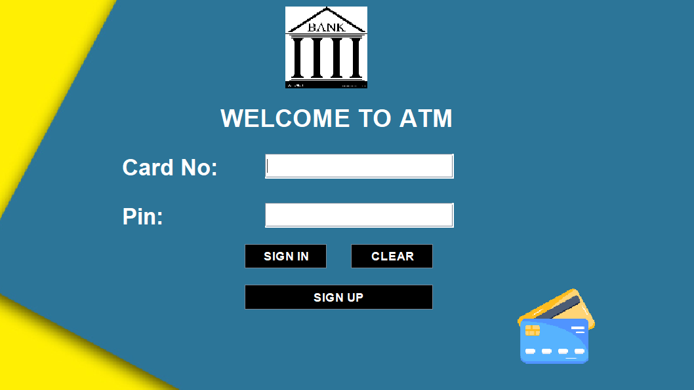
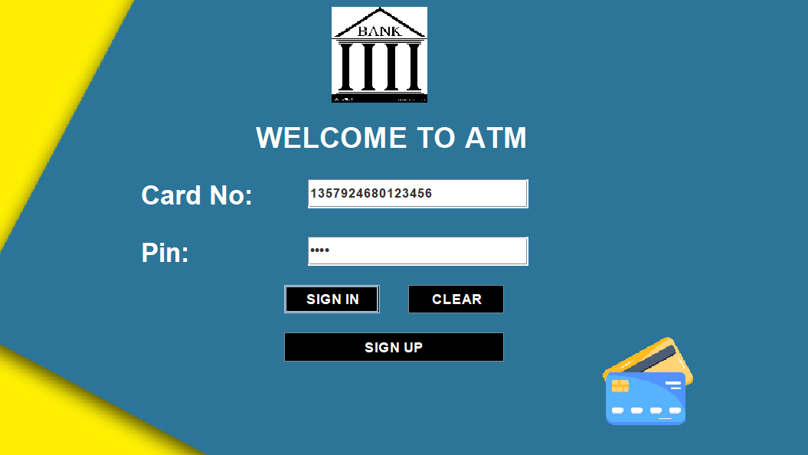

# 🏦 Bank Management System (Digital ATM)


---

## 📌 About
The **Bank Management System** is a **Java Swing-based desktop application** that simulates a **digital ATM**.  
It provides a user-friendly GUI for performing banking operations such as deposits, withdrawals, balance inquiry, and **E-Mini Statements** for quick transaction summaries.

This project demonstrates **Object-Oriented Programming (OOP)** principles, **GUI design with Swing**, and **integration with MySQL** for secure data management.

---

## ✨ Features
- 🔑 **User Authentication** – Secure login with account credentials.  
- 💰 **Deposit & Withdraw** – Manage funds like a real ATM.  
- 👀 **Balance Inquiry** – Check account balance instantly.  
- 📜 **E-Mini Statement** – View a short summary of recent transactions (like ATM receipts).  
- 🖥️ **Interactive GUI** – Built with Java Swing for a smooth user experience.  
- 🗄️ **Database Support** – MySQL stores user info and transaction history.  

---

## 🛠️ Tech Stack
- **Language:** Java (Swing for GUI)
- **Database:** MySQL (JDBC connectivity)
- **IDE:** IntelliJ IDEA
- **Version Control:** Git & GitHub

---

## ⚡ Getting Started

### Login 


### Sign Up


### Sign In


### Digital ATM


### Deposit


### Withdraw


### Fast Cash


### Check Balance


### Change PIN Alert

### PIN Change


### E-Mini Statement


### 1️⃣ Clone the repository
```bash
git clone https://github.com/JayshreeR18/Bank-Management-System.git
